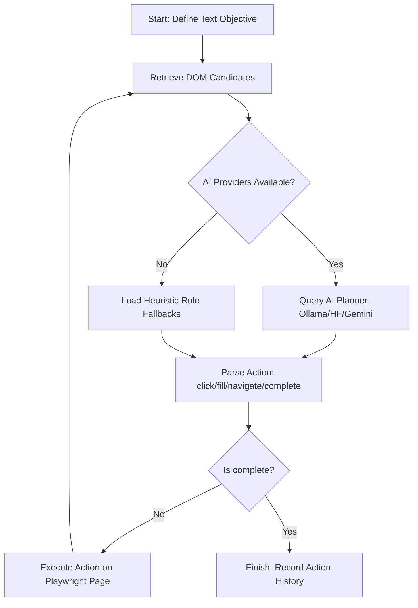

# Stagehand Test Plan & Scope

The `tests/stagehand/` folder introduces a declarative AI Browser Agent and Planner built directly into our test framework. Rather than writing traditional step-by-step UI actions (clicks, fills, assertions), Stagehand allows developers to define high-level text objectives.

## Orchestration and Execution Flow

The Stagehand agent (`src/framework/stagehand/agent.py`) executes objectives using an iterative planning loop:



## Running Stagehand Tests

To run the Stagehand agent test suite, specify the `stagehand` branch to `runner.py`:

```bash
python runner.py --branch stagehand
```

### AI Configuration

Stagehand queries LLMs in this order of priority:
1. **Ollama:** Looks for a local Ollama server running at `http://localhost:11434` (model `qwen2.5-coder:1.5b` or custom).
2. **Hugging Face:** Queries a hosted open-source model like `Qwen/Qwen2.5-Coder-7B-Instruct` using `HF_API_TOKEN` env variable.
3. **Gemini:** Queries `gemini-2.5-flash` using `GEMINI_API_KEY`.
4. **Local Heuristics:** Falls back to offline, deterministic rule-based planning for zero setup costs.
